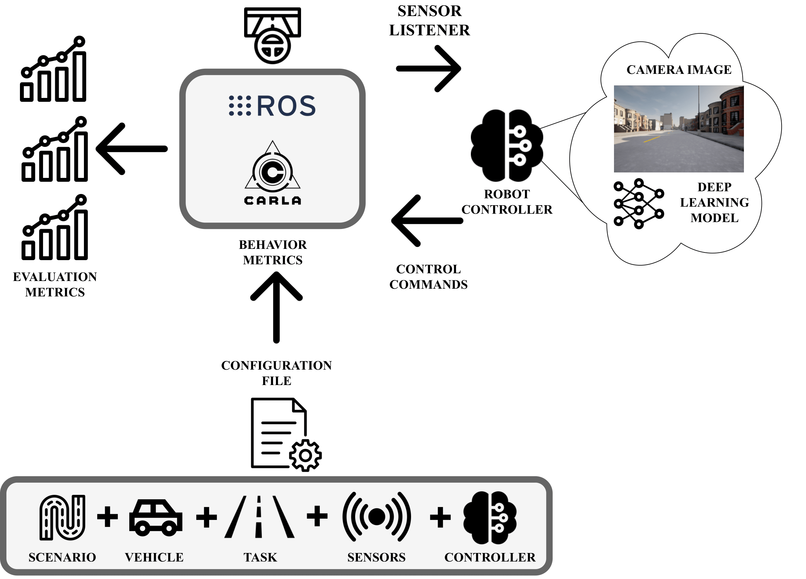
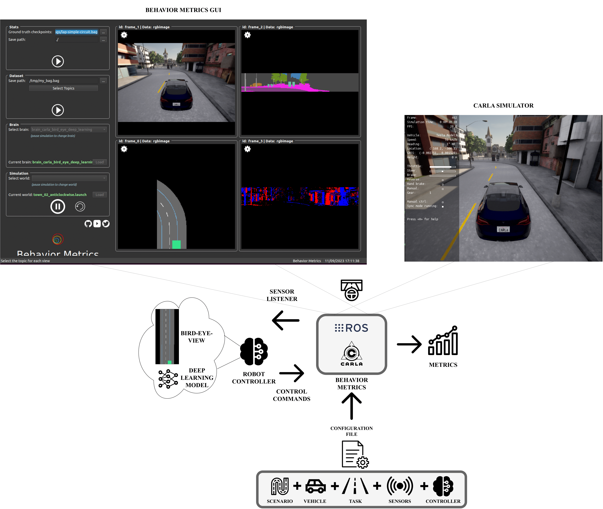
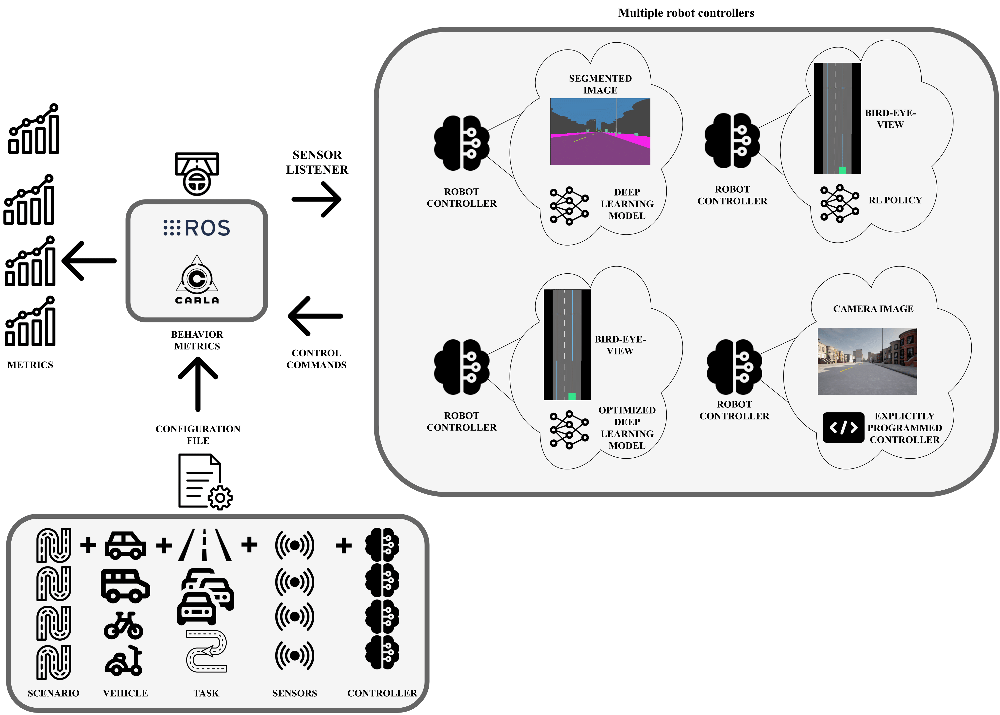
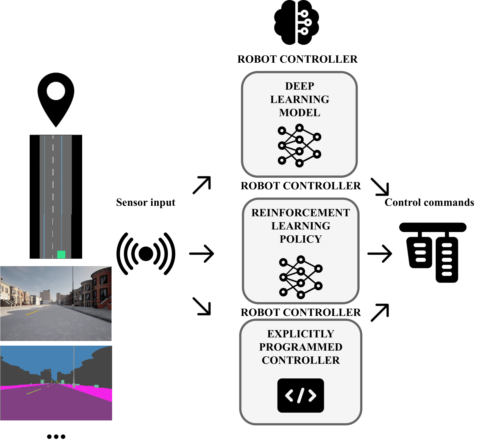
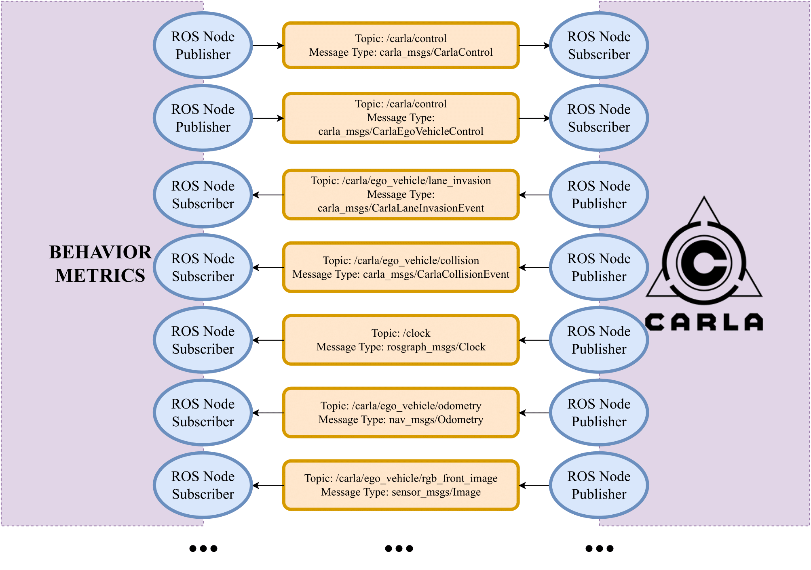

[](https://github.com/JdeRobot/BehaviorMetrics/actions/workflows/main.yml)
[](https://github.com/JdeRobot/BehaviorMetrics/actions/workflows/generate_docker_10_1_cudnn7.yml)
[](https://github.com/JdeRobot/BehaviorMetrics/actions/workflows/generate_docker_cuda_11.yml)
# Behavior Metrics

This software tool provides evaluation capabilities for autonomous driving solutions using simulation. 
We provide a series of quantitative metrics for the evaluation of autonomous driving solutions with support for two simulators, [CARLA](https://carla.org/) (main supported simulator) and [gazebo](https://gazebosim.org/home) (partial support).
Currently supported tasks include:

* Follow-lane
* Driving in traffic
* Navigation

Each task comes with its custom evaluation metrics that can help compare autonomous driving solutions.
The main component of the ego vehicle is the controller (brain), which receives sensor data, manipulates it and generates robot control commands based on it. 
The inner part of the brain can be controlled by an end-to-end deep learning model, written in Tensorflow or PyTorch, a reinforcement learning policy, or even an explicitly programmed policy.

The software provides two main pipelines, a graphical user interface (GUI) and a headless mode (scripted). 
The first one is intended for testing one brain+model (controller) at a time and debugging it visually while the headless mode is intended for running lots of experiments at the same time for comparison of a batch of brain+models (controllers) in different scenarios.





### Installation

For more information about the project and how to install it, you can consult the [website of Behavior Metrics](https://jderobot.github.io/BehaviorMetrics/). 

### Examples

We provide examples for the follow-lane task using CARLA:

* For an example of a robot brain using a Tensorflow model for control with GUI pipeline, run:

```
python3 driver_carla.py -c configs/CARLA/default_carla_tensorflow.yml -g
```

* For an example of a robot brain using a PyTorch model for control with GUI pipeline, run:

```
python3 driver_carla.py -c configs/CARLA/default_carla_torch.yml -g
```

* For an example of an explicitly programmed robot brain with GUI pipeline, run:

```
python3 driver_carla.py -c configs/CARLA/default_carla.yml -g
```

* For an example of the headless pipeline, run:

```
python3 driver_carla.py -c configs/CARLA/default_carla_multiple.yml -s
```
### Citation

Check out the paper [website](https://roboticslaburjc.github.io/publications/2024/behavior_metrics_an_open_source_assessment_tool_for_autonomous_driving_tasks).

If you find our repo useful, please cite us as:
```bibtex
@article{PANIEGO2024101702,
title = {Behavior metrics: An open-source assessment tool for autonomous driving tasks},
journal = {SoftwareX},
volume = {26},
pages = {101702},
year = {2024},
issn = {2352-7110},
doi = {https://doi.org/10.1016/j.softx.2024.101702},
url = {https://www.sciencedirect.com/science/article/pii/S2352711024000736},
author = {Sergio Paniego and Roberto Calvo-Palomino and JoséMaría Cañas},
keywords = {Evaluation tool, Autonomous driving, Imitation learning},
abstract = {The development and validation of autonomous driving solutions require testing broadly in simulation. Addressing this requirement, we present Behavior Metrics (BM) for the quantitative and qualitative assessment and comparison of solutions for the main autonomous driving tasks. This software provides two evaluation pipelines, one with a graphical user interface used for qualitative assessment and the other headless for massive and unattended tests and benchmarks. It generates a series of quantitative metrics complementary to the simulator’s, including fine-grained metrics for each particular driving task (lane following, driving in traffic, route navigation, etc.). It provides a deeper and broader understanding of the solutions’ performance and allows their comparison and improvement. It uses and supports state-of-the-art open software such as the reference CARLA simulator, the ROS robotics middleware, PyTorch, and TensorFlow deep learning frameworks. BehaviorMetrics is available open-source for the community.}
}
```


### Contributing to the project

If you want to contribute, please first check out [CONTRIBUTING.md](CONTRIBUTING.md) section.


### Evaluation modes

Behavior Metrics provides two different evaluation modes, GUI evaluation and headless.

#### GUI

In this mode, activated with flag `-g`, the simulator and software application are displayed.

* Video:

[](https://www.youtube.com/watch?v=ze_LDkmCymk)

* Scheme:



#### Headless

In this mode, activated with flag `-s`, the evaluation is conducted without graphical interface.

* Video:

[](https://www.youtube.com/watch?v=rcrOF5t3MC4)

* Scheme:



### Robot controller

The robot controller (brain folder) is the main controller of the ego vehicle.



Behavior Metrics uses a publish/subscribe design to communicate with the simulator


