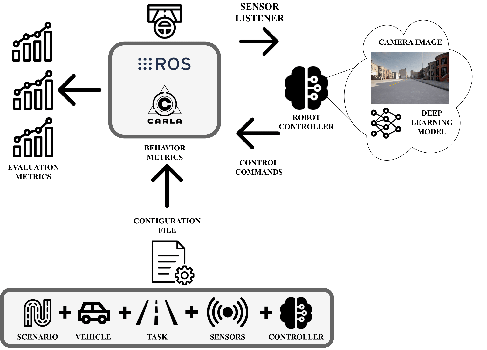
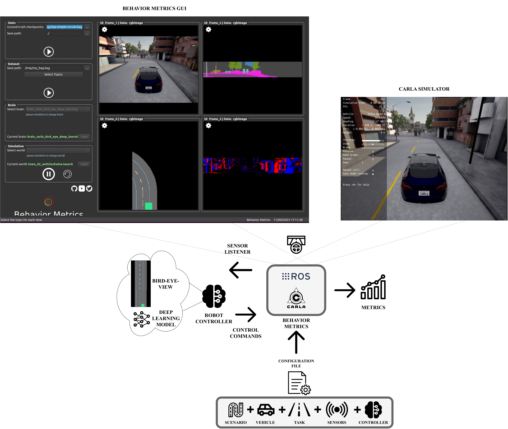
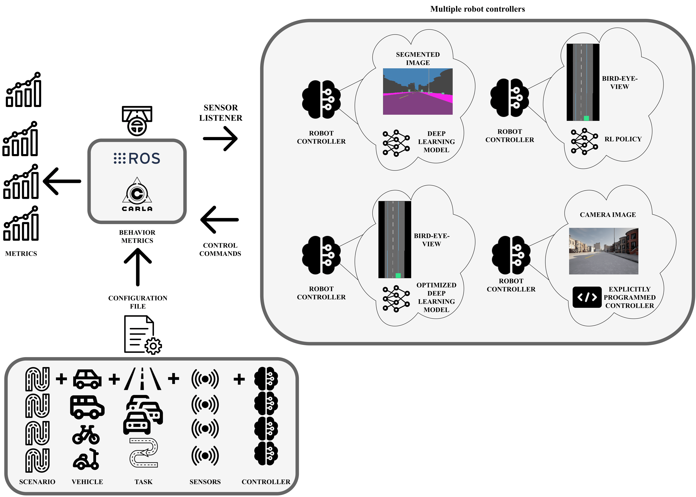
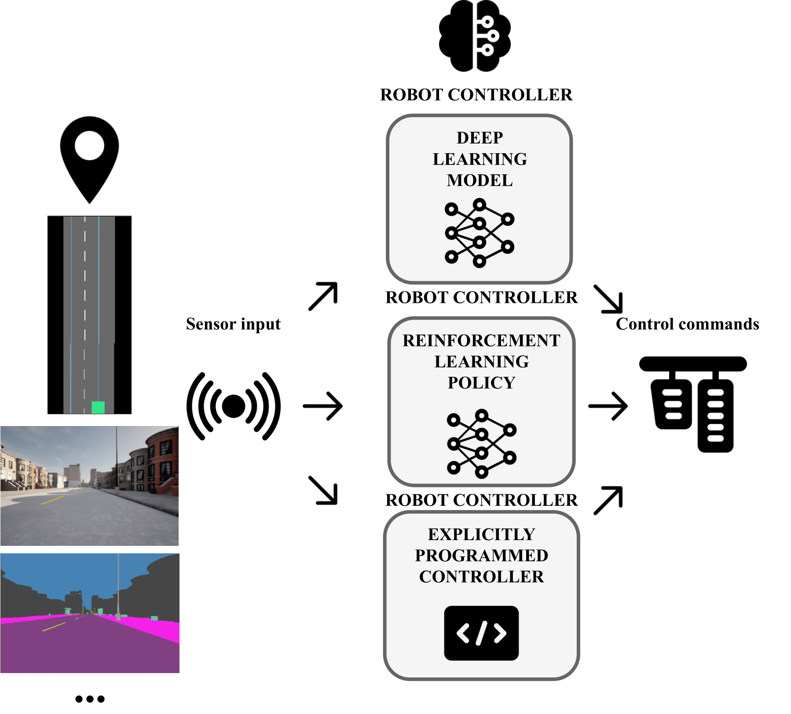
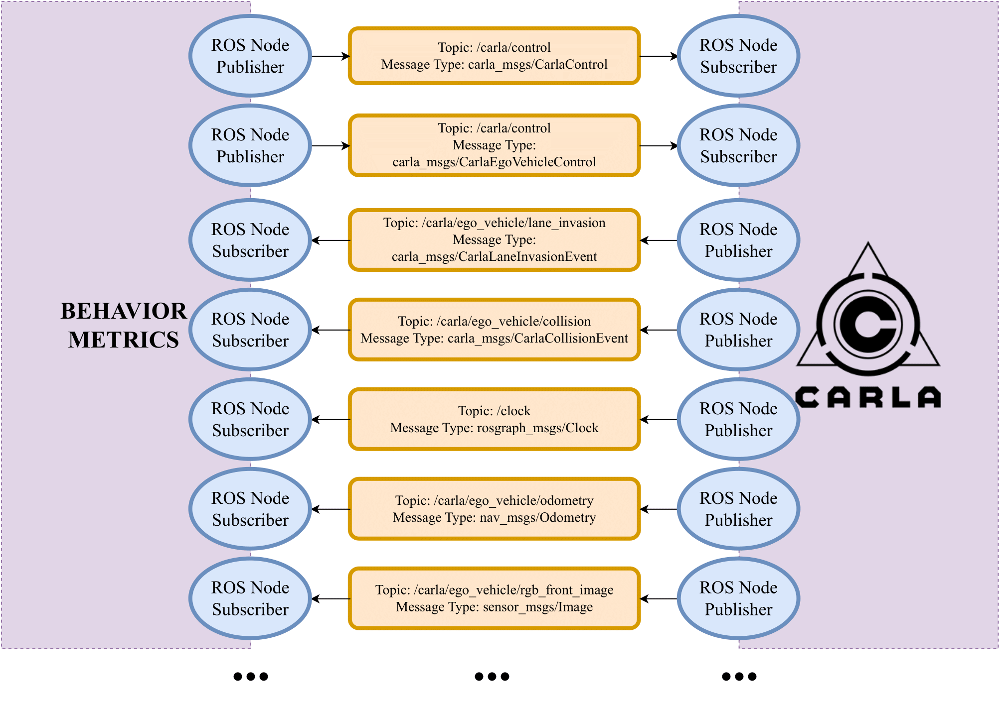

[](https://github.com/JdeRobot/BehaviorMetrics/actions/workflows/main.yml)
[](https://github.com/JdeRobot/BehaviorMetrics/actions/workflows/generate_docker_10_1_cudnn7.yml)
[](https://github.com/JdeRobot/BehaviorMetrics/actions/workflows/generate_docker_cuda_11.yml)
# Behavior Metrics

This software tool provides evaluation capabilities for autonomous driving solutions using simulation. 
We provide a series of quantitative metrics for the evaluation of autonomous driving solutions with support for two simulators, [CARLA](https://carla.org/) (main supported simulator) and [gazebo](https://gazebosim.org/home) (partial support).
Currently supported tasks include:

* Follow-lane
* Driving in traffic
* Navigation

Each task comes with its custom evaluation metrics that can help compare autonomous driving solutions.
The main component of the ego vehicle is the controller (brain), which receives sensor data, manipulates it and generates robot control commands based on it. 
The inner part of the brain can be controlled by an end-to-end deep learning model, written in Tensorflow or PyTorch, a reinforcement learning policy, or even an explicitly programmed policy.

The software provides two main pipelines, a graphical user interface (GUI) and a headless mode (scripted). 
The first one is intended for testing one brain+model (controller) at a time and debugging it visually while the headless mode is intended for running lots of experiments at the same time for comparison of a batch of brain+models (controllers) in different scenarios.





### Tasks

Below is a detailed description of each supported task, including how to launch them and the evaluation metrics they provide.

#### 1. Follow Lane (`follow_lane`)

The **follow lane** task is the default task in Behavior Metrics. The ego vehicle must autonomously follow a lane on a predefined circuit without any other traffic participants. This is the simplest task and serves as the baseline for evaluating autonomous driving controllers.

**Simulator support:** CARLA and Gazebo

**How to launch (CARLA, GUI mode):**

```bash
python3 driver_carla.py -c configs/CARLA/default_carla.yml -g
```

**How to launch (Gazebo, GUI mode):**

```bash
python3 driver_gazebo.py -c configs/gazebo/default.yml -g
```

The task is configured in the YAML configuration file. When no `Task` field is specified under the `Simulation` section, `follow_lane` is used by default. Several CARLA towns and circuit directions (clockwise/anticlockwise) are available through the launch files in `configs/CARLA/CARLA_launch_files/`.

**Evaluation metrics:**
- **Completed distance** -- total distance (in meters) traveled by the ego vehicle.
- **Average speed** -- mean speed over the experiment duration.
- **Percentage completed** -- percentage of the circuit completed relative to a reference perfect lap.
- **Position deviation MAE** -- mean absolute error of the vehicle's position relative to the ideal trajectory.
- **Lap time** -- time taken to complete a full lap (if the lap is completed).
- **Brain iteration frequency** -- how often the controller produces commands (in both simulated and real time).
- **Mean inference time** -- average time for the brain model to produce a control command.

#### 2. Follow Lane with Traffic (`follow_lane_traffic`)

The **follow lane with traffic** task extends the follow lane task by adding dynamic obstacles to the environment, including other vehicles and pedestrians. The ego vehicle must follow the lane while avoiding collisions with the surrounding traffic.

**Simulator support:** CARLA

**How to launch (GUI mode):**

```bash
python3 driver_carla.py -c configs/CARLA/default_carla_traffic.yml -g
```

To configure this task, set the `Task` field to `follow_lane_traffic` under the `Simulation` section of the YAML configuration file. The number of vehicles and pedestrians can be controlled through the following configuration parameters:

```yaml
Simulation:
    Task: "follow_lane_traffic"
    NumberOfVehicle: 50
    NumberOfWalker: 50
    PercentagePedestriansRunning: 0.5
    PercentagePedestriansCrossing: 0.5
```

Several scenario variants are available through different configuration files:
- `default_carla_traffic.yml` -- vehicles and pedestrians on Town01.
- `default_carla_pedestrian.yml` -- pedestrians only.
- `default_carla_parked_vehicle.yml` -- parked (static) vehicles as obstacles.
- `default_carla_parked_bike.yml` -- parked bikes as obstacles.
- `default_carla_parked_bike_car.yml` -- parked bikes and cars as obstacles.
- `default_carla_pedestrian_parked_bike_car.yml` -- pedestrians combined with parked obstacles.

**Evaluation metrics:**

In addition to all the follow lane metrics listed above, this task also tracks:
- **Number of collisions** -- total number of distinct collisions during the experiment.
- **Collision actor IDs** -- identifiers of the actors involved in each collision.

#### 3. Follow Route / Navigation (`follow_route`)

The **follow route** task requires the ego vehicle to navigate through a sequence of predefined waypoints (a route) across the map, including making turns at intersections. This is the most complex task, as the vehicle must handle diverse road geometries and potentially traffic. Routes are organized into test suites.

**Simulator support:** CARLA

**How to launch (headless/script mode):**

```bash
python3 driver_carla.py -c configs/CARLA/default_carla_test_suite.yml -s
```

To configure this task, set the `Task` field to `follow_route` and specify a test suite:

```yaml
Simulation:
    Task: "follow_route"
    TestSuite: "Town02_two_turns"
    NumRoutes: 2
    RandomizeRoutes: False
    NumberOfVehicle: 50
    NumberOfWalker: 0
```

Test suites are defined in `configs/CARLA/test_suites/` and specify a collection of start/end waypoints that the vehicle must navigate between.

**Evaluation metrics:**

The follow route task uses the same metrics as the follow lane task (completed distance, average speed, percentage completed, position deviation, inference time, etc.), along with route-specific completion tracking across the defined waypoints.

> **Note:** The `follow_route` task only supports the headless/script mode (`-s` flag). It does not support the GUI mode (`-g` flag).

#### Gazebo-specific tasks

In addition to the CARLA-based tasks, Behavior Metrics provides partial support for autonomous driving tasks in Gazebo, primarily targeting the **follow line** task with an F1 racing car on simulated circuits. The available configuration files include support for deep learning brains (TensorFlow and PyTorch), reinforcement learning algorithms (Q-learning, DQN, DDPG, PPO), and explicitly programmed controllers.

**Example configurations:**
- `configs/gazebo/default.yml` -- explicitly programmed follow-line brain.
- `configs/gazebo/DL-torch.yml` -- PyTorch deep learning brain.
- `configs/gazebo/DL-tensorflow.yml` -- TensorFlow deep learning brain.
- `configs/gazebo/default-rl-qlearn.yml` -- Q-learning reinforcement learning brain.
- `configs/gazebo/default-drone.yml` -- drone follow-line task.


### Installation

For more information about the project and how to install it, you can consult the [website of Behavior Metrics](https://jderobot.github.io/BehaviorMetrics/). 

### Examples

We provide examples for the follow-lane task using CARLA:

* For an example of a robot brain using a Tensorflow model for control with GUI pipeline, run:

```
python3 driver_carla.py -c configs/CARLA/default_carla_tensorflow.yml -g
```

* For an example of a robot brain using a PyTorch model for control with GUI pipeline, run:

```
python3 driver_carla.py -c configs/CARLA/default_carla_torch.yml -g
```

* For an example of an explicitly programmed robot brain with GUI pipeline, run:

```
python3 driver_carla.py -c configs/CARLA/default_carla.yml -g
```

* For an example of the headless pipeline, run:

```
python3 driver_carla.py -c configs/CARLA/default_carla_multiple.yml -s
```
### Citation

Check out the paper [website](https://roboticslaburjc.github.io/publications/2024/behavior_metrics_an_open_source_assessment_tool_for_autonomous_driving_tasks).

If you find our repo useful, please cite us as:
```bibtex
@article{PANIEGO2024101702,
title = {Behavior metrics: An open-source assessment tool for autonomous driving tasks},
journal = {SoftwareX},
volume = {26},
pages = {101702},
year = {2024},
issn = {2352-7110},
doi = {https://doi.org/10.1016/j.softx.2024.101702},
url = {https://www.sciencedirect.com/science/article/pii/S2352711024000736},
author = {Sergio Paniego and Roberto Calvo-Palomino and JoséMaría Cañas},
keywords = {Evaluation tool, Autonomous driving, Imitation learning},
abstract = {The development and validation of autonomous driving solutions require testing broadly in simulation. Addressing this requirement, we present Behavior Metrics (BM) for the quantitative and qualitative assessment and comparison of solutions for the main autonomous driving tasks. This software provides two evaluation pipelines, one with a graphical user interface used for qualitative assessment and the other headless for massive and unattended tests and benchmarks. It generates a series of quantitative metrics complementary to the simulator’s, including fine-grained metrics for each particular driving task (lane following, driving in traffic, route navigation, etc.). It provides a deeper and broader understanding of the solutions’ performance and allows their comparison and improvement. It uses and supports state-of-the-art open software such as the reference CARLA simulator, the ROS robotics middleware, PyTorch, and TensorFlow deep learning frameworks. BehaviorMetrics is available open-source for the community.}
}
```


### Contributing to the project

If you want to contribute, please first check out [CONTRIBUTING.md](CONTRIBUTING.md) section.


### Evaluation modes

Behavior Metrics provides two different evaluation modes, GUI evaluation and headless.

#### GUI

In this mode, activated with flag `-g`, the simulator and software application are displayed.

* Video:

[](https://www.youtube.com/watch?v=ze_LDkmCymk)

* Scheme:



#### Headless

In this mode, activated with flag `-s`, the evaluation is conducted without graphical interface.

* Video:

[](https://www.youtube.com/watch?v=rcrOF5t3MC4)

* Scheme:



### Robot controller

The robot controller (brain folder) is the main controller of the ego vehicle.



Behavior Metrics uses a publish/subscribe design to communicate with the simulator


