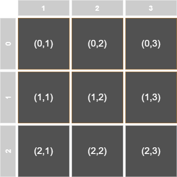
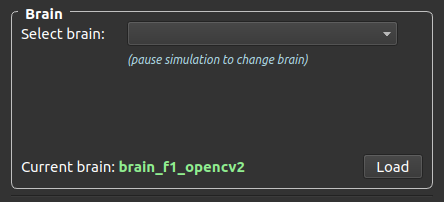
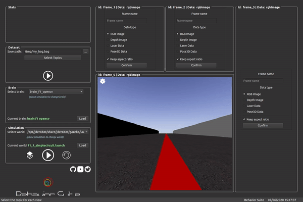

# Behavior Studio

This project aims to have a platform for evaluating and testing complex behaviors for different robots using machine learning and deep learning algorithms. This application provides different functionalities such as:

* Loading a simulated environment for different scenarios where you can evaluate complex robots behaviors.
* Generating datasets to train your models to be tested later.
* Evaluate the performance of your models comparing them against a other models.
* Change the scenarios/models (called brains) on the go.
* Live view of sensor readings.

The algorithms that command the robots are called brains, and there is where the neural logic (behaviors) is at.


## Installation

This application depends on dome third party libraries, most of them are included in the requirements file. To install them just type the following:

```bash
pip install -r requirements.txt
```

However since this project is built under python 2.7 the Qt5 dependencies cannot be installed via pip (it's included in the pip3 repositories). So it's needed to install the Qt5 dependencies through apt as follows:

```bash
INSTALL QT5 and PYQT5
```

```
INSTALL QT3D????
```


## Quick start

First of all you need to install all the dependencies from the previous section.

To run the application with GUI (Graphic User Interface) just run:

```bash
python driver.py -c default.yml -g
```

To run the application with TUI (Terminal User Interface) just run:

```bash
python driver.py -c default.yml -t
```


## How to use

To launch the application just run the python script as follows:

```bash
python driver.py -c default.yml -g
```

This command will launch the application with the default configuration:

* Simulated world of a F1 car inside a circuit
* Sensors: RGB camera and odometry
* Actuators: Motors
* Explicit brain based on OpenCV image processing.

The program allows the following arguments:

* `-c <profile>` or `--config <profile>`: this argument is mandatory and specifies the path of the configuration file for the application.
* `-g` or `--gui`: this argument is optional and enables the GUI launching. If not specified, it will show the TUI (terminal user interface).
* `-t` or `--tui`: this argument is optional and enables the TUI.

For more information run `help driver.py` in a terminal.


### Building your configuration file

If you want to create your own **configuration file** for the application (changing the robot, brain, layout, etc) you can either use the desktop GUI or creating a yml file with your own configuration. The default profile looks like this (**Make sure you respect the indentation**):

```yaml
Behaviors:
    Robot:
        Sensors:
            Cameras:
                Camera_0:
                    Name: 'camera_0'
                    Topic: '/F1ROS/cameraL/image_raw'
            Pose3D:
                Pose3D_0:
                    Name: 'pose3d_0'
                    Topic: '/F1ROS/odom'
        Actuators:
            Motors:
                Motors_0:
                    Name: 'motors_0'
                    Topic: '/F1ROS/cmd_vel'
                    MaxV: 3
                    MaxW: 0.3
        BrainPath: 'brains/f1/brain_f1_opencv2.py'
        Type: 'f1'
    Simulation:
        World: /opt/jderobot/share/jderobot/gazebo/launch/f1_1_simplecircuit.launch
    Dataset:
        In: '/tmp/my_bag.bag'
        Out: ''
    Layout:
        Frame_0:
            Name: frame_0
            Geometry: [1, 1, 2, 2]
            Data: rgbimage
        Frame_1:
            Name: frame_1
            Geometry: [0, 1, 1, 1]
            Data: rgbimage
        Frame_2:
            Name: frame_2
            Geometry: [0, 2, 1, 1]
            Data: rgbimage
        Frame_3:
            Name: frame_3
            Geometry: [0, 3, 3, 1]
            Data: rgbimage
```

The keys of this file are as follows:

**Robot**

This key defines the robot configuration:

* **Sensors**: defines the sensors configuration. Every sensor **must** have a name and a ROS topic. 
* **Actuators**: defines the actuators configuration. Every actuator **must** have a name and a ROS topic.
* **BrainPath**: defines the path where the control algorithm is located in your system.
* **Type**: defines the type of robot. Possible values: f1, drone, turtlebot, car.

**Simulation**

This key defines the launch file of the environment. It can be used to launch a gazebo simulation or a real robot.

**Dataset**

This key define the dataset output path.

**Layout**

This key defines how the GUI will be shown. This is the trickiest part of the configuration file. The grid of the GUI is a 3x3 matrix where you can configure the layout positions to show your sensors data. Each *Frame_X* key corresponds to a view of a sensor in the GUI and includes the following keys:

* Name: this is mandatory in order to send data to that frame in the GUI to be shown.
* Geometry: is the position and size configuration of that frame following this criteria: ` [x, y, height, width]`
* Data: tells the GUI which kind of GUI should be create in order to show the information. Possible values: rgbimage, laser, pose3d.

The geometry is defined as follows.



So if you want to create a view for one of the camera sensors of the robot located in the top-left corner of size 1x1 followed by another view of another camera in the bottom-right corner of size 2x2, you should configure the geometry array as:

```yaml
Frame_0:
    Name: 'Camera1'
    Geometry: [0, 1, 1, 1]
    Data: rgbimage
Frame_1:
    Name: 'Camera2'
    Geometry: [1, 2, 2, 2]
```

So it will look like this in the GUI:


Following this logic, you will see that the **default configuration** file will show something like this:


### Using the application

Once the configuration file is created and the application has launched, you will see something like this (depending on your layout configuration. We assume you launched the default profile):


You will see 2 different sections, one on the left: **the toolbar**, and another one in the right: **the layout**. 

#### The toolbar

You have all the tools needed for controlling the whole application, simulation and control of the application. For usability sake, this section is subdivided in 4 different subsections: **stats, dataset, brains** and **simulation**.


**Stats**

[WIP]

**Dataset**


This subsection will allow you to specify where the datasets will be saved by setting up the path and the name of the bag file.

To specify the output ROS bag file, just click on the three dots and a dialog window will open with the file system.

The button **Select topics** is used to select which active topics the user wants to record in the ROS bag file.

Use the play button to start/stop recording the rosbag.

**Note: if you don't change your ROS bag name between recordings, the file will be overwritten with the new recording data.**

**Brain**



This subsection will allow you to control the logic of the robot: its behavior. 

You have a drop-down menu that will detect the available brains for the current simulation, so you can select whatever brain you want in each moment. **This can be done on the go, if the simulation is paused**

The **Load** button will load a new brain in execution time **if the simulation is paused**



All of this tools will be disabled while the simulation is running, so in order to interact with it, you should pause the simulation first.

**Simulation**


This subsection will allow you to control the simulation.

You have a drop-down menu to change the world of the simulation on the go **if the simulation is paused**

The **Load** button will load the specified world in the drop-down menu **if the simulation is paused**

You have 3 additional buttons which:

* Will load Gazebo GUI if it wasn't launched, or close it otherwise


* Play/pause button for **pausing/resuming the simulation**


* Reload button will reload the simulation by resetting the robot position and both real and simulation time.


respectively.

#### The layout

This section is meant to show the data coming from the sensors of the robot (cameras, laser, odometry, etc.). For that purpose, the GUI is divided in sections conforming a **layout**. This disposition will come specified in the configuration file (see *Building your configuration file*) section.


As you can see, there are several boxes or **frames** that will host data from different sensors. The view above shows the GUI before specifying what kind of sensor and data the frame will show. You only have to give the frame a **name** (if you leave it blank it will take the default name *frame_X* where X is the frame number), and pick which kind of data that frame will contain by clicking on one of the radio buttons.


As you type down the name of the frame, you will see how the name in the top-left corner of the frame changes dynamically.


Once you have chosen the frame name (this is important for later), you have to chose the data type the frame will show, from one of the checkboxes below the name textbox. After that, you will only have to click the **Confirm** button and the sensor will show its data.


## Architecture

The infrastructure of this application is composed of different pieces of software, as shown in the image below. It is based on the Model-View-Controller (MVC) architecture where we have the **model** (the main logic of the application), the **view** (the user interface) and the **controller** that acts as a form of intercommunication of the previous ones.


The core of the application are the driver and the pilot modules, which are responsible for the management of the application and the management of the robot and behaviors respectively.

### Model

The following modules are part of the model of the MVC.

**Driver (driver.py)**

This can be considered the main module, which loads the application and initialize all its components. This module loads the environment, the robot sensors and actuators, read the profile (configuration) file, etc. 

**Pilot (pilot.py)**

The pilot module is loaded by the driver and is in charge of managing the loading/unloading/reloading of the brains, sensors and actuators of the robot and the periodic execution of the behaviors defined in the brains.

### View

The view part of the architecture is composed of two different types of views:

* Desktop based GUI
* Console based GUI

**Desktop based GUI**

This GUI is built using the Qt framework. It's composed of several components (called widgets) and manages the different views of the application. For more information check *How to contribute* section and the code documentation.

**Console based GUI**

[WIP] This GUI is built using the *npyscreen* library, which is an open source library for building pretty user interfaces in the linux terminal. This is a simpler GUI due to its limitations, but it allows the user to use the application almost in the same way as using the desktop but using the keyboard. For more information check *How to contribute section* and the code documentation.

### Controller

This part of the application is in a single module called *controller.py* and is responsible for the intercommunication between the model and the view. It is made in such a way that the model increases its performance without having to wait for the view to process the data.


## Programing a custom brain

