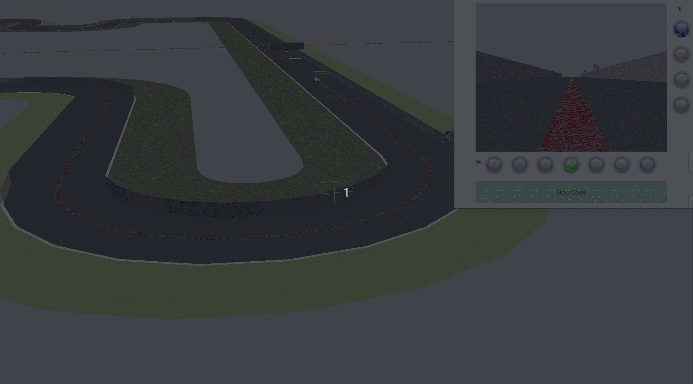

<a href="https://mmg-ai.com/en/"></a>

# Vision-based end-to-end learning

- [Usage](#usage)
- [Dataset](#datasets)
- [Models](#models)
- [Solutions](#solutions)
  - [Manual Solution](#manual-solution)
  - [Classification Network](#classification-network)
  - [Regression Network](#regression-network)
- [FAQ](#faq)

The objective of this project is to **take images** from the camera on a circuit where the mission is to follow a red line to complete a lap of the circuit **using classification and regression neural networks**.

## Info

- More detailed info at my [Github-pages](https://roboticslaburjc.github.io/2017-tfm-vanessa-fernandez/).


## Datasets

There are currently **two sets** of data to train the neural network that resolves the circuit. One contains **images of all types** such as straights and curves and the other contains **only the curves** of the circuit. The second one is smaller and the results are good enough to solve a lap of the circuit.

- [Complete dataset](http://wiki.jderobot.org/store/jmplaza/uploads/deeplearning-datasets/vision-based-end2end-learning/complete_dataset.zip).
- [Curve dataset](http://wiki.jderobot.org/store/jmplaza/uploads/deeplearning-datasets/vision-based-end2end-learning/curves_only.zip).

## Models

The models used in this repository are the following:

| Model                     | Links                                                        | Image                                                       |
| ------------------------- | ------------------------------------------------------------ | ----------------------------------------------------------- |
| PilotNet                  | [Paper](https://arxiv.org/pdf/1704.07911.pdf). [Nvidia source.](https://devblogs.nvidia.com/explaining-deep-learning-self-driving-car/) | [Structure](./docs/imgs/model_pilotnet.png)                 |
| TinyPilotNet              | [Javier del Egido Sierra](https://ebuah.uah.es/dspace/bitstream/handle/10017/33946/TFG_Egido_Sierra_2018.pdf?sequence=1&isAllowed=y) TFG's. | -                                                           |
| LSTM                      | [Info](https://colah.github.io/posts/2015-08-Understanding-LSTMs/) | -                                                           |
| LSTM TinyPilotNet         | -                                                            | [Structure](./docs/imgs/model_lstm_tinypilotnet.png)        |
| Deepest LSTM TinyPilotNet | [Javier del Egido Sierra](https://ebuah.uah.es/dspace/bitstream/handle/10017/33946/TFG_Egido_Sierra_2018.pdf?sequence=1&isAllowed=y) TFG's. | [Structure](./docs/imgs/model_deepestlstm_tinypilotnet.png) |
| ControlNet                | -                                                            | [Structure](./docs/imgs/model_controlnet.png)               |
| Stacked                   | -                                                            | [Structure](./docs/imgs/model_stacked.png)                  |
| Stacked Dif or Temporal   | -                                                            | -                                                           |

The models are available in the [following repository](http://wiki.jderobot.org/store/jmplaza/uploads/deeplearning-models/models.zip).


## Installation

- First of all, we need to **install the JdeRobot environment** packages. We need two packages: [JdeRobot-base](https://github.com/JdeRobot/base) and [JdeRobot-assets](https://github.com/JdeRobot/assets). You can follow [this tutorial](https://github.com/JdeRobot/base#getting-environment-ready) for the complete installation.

- Install ROS plugins typing:

    ```bash
    sudo apt install ros-melodic-gazebo-plugins
    ```

- Clone the repository :

    ```bash
    git clone https://github.com/RoboticsLabURJC/2017-tfm-vanessa-fernandez.git
    ```

- Create and activate a virtual environment:

    ```bash
    virtualenv -p python2.7 --system-site-packages neural_behavior_env
    ```

- Install `requirements`:

  ```bash
  pip install -r requirements.txt
  ```

- Launch Gazebo with the F1 world through the command:

    ```bash
    roslaunch /opt/jderobot/share/jderobot/gazebo/launch/f1_1_simplecircuit.launch
    ```

- Then you have to execute the application, which will incorporate your code:

    ```bash
    python2 driver.py driver.yml
    ```


## Usage

### 1. Manual Solution

For this solution, the **code developed in the robotics course of the Official Master's Degree** in **Computer Vision** has been used. The structure of the project allows to combine between the different solutions. As a first approach, the one developed manually by a student or user is used.

An excerpt of the solution can be seen in the following gif:




### 2. Classification Network

The solution using **classification networks** leaves a somewhat slower solution than the manual solution but equally useful. A piece of the solution can be seen in the following gif.


Depending on the type of network you want to run (normal or cropped) you have to change the size of the images entering the network in the `ckassification_network.py` file.

For **cropped images**, the values are:

```python
. . .
self.img_height = 60
self.img_width = 160
. . . 
```

You also need to change the predict method to configure it to the image type:

```python
def predict(self):
    input_image = self.camera.getImage()
    # Preprocessing
    img = cv2.cvtColor(input_image.data[240:480, 0:640], cv2.COLOR_RGB2BGR)
    . . .
```

For **normal images**, the default value is:

```python
. . . 
self.img_height = 120
. . .
```

The `predict` method is the same but without cropping the image:

```python
def predict(self):
    input_image = self.camera.getImage()
    # Preprocessing
    img = cv2.cvtColor(input_image.data, cv2.COLOR_RGB2BGR)
    . . .
```

In the same file you can specify the number of output classes, which refers to the number of possible rotation angles.

```python
self.num_classes_w = 7
```

#### Train Classification Network

To train the classification network to run the file:

```bash
cd 2017-tfm-vanessa-fernandez/Follow Line/dl-driver/Net/Keras/ 
python classification_train.py
```

When the program is running it will ask for data to know the characteristics of the network to be trained:

1. **Choose one of the options for the number of classes:** *Choose the number of classes you want, typically 4-5 for `v` parameter and 2, 7 or 9 for `w` parameter. Depending on the dataset created, there are different classifications in the json depending on the number of classes for each screen.*

2. **Choose the variable you want to train:** `v` or `w`: *here you put `v` or `w` depending on the type of speed you want to train (traction or turn).*

3. **Choose the type of image you want:** `normal` or `cropped`: *you can choose `normal` or `cropped`. If you want to train with the full image you have to choose `normal` and if you want to train with the cropped image choose `cropped`.*

4. **Choose the type of network you want: normal, biased or balanced:** *this option refers to the type of dataset or training you want.* 

   *The documentation talks about having on the one hand a training with the whole dataset without any type of treatment of the number of images for each class (there were many more straight lines than curves) or using a balanced dataset that we created keeping the same number of images for each class (v and w),* 

   *To train with that configuration, set the `normal` option. To train with balanced dataset, set the option: `balanced`.*

   *And finally, `biased` refers to you training with the full dataset (unbalanced) but in training you put weights to each class with `class_weigth` type.*

   ```python
   class_weight = {0: 4., 1: 2., 2: 2., 3: 1., 4:2., 5: 2., 6: 3.}
   ```

   *then with this option you can give more weight to the kinds of curves than straight lines. In that example the class 0 is the class `radically_left` and the 6 would be `radically_right`. The option that worked best was that of 'biased'.*

5. **Choose the model you want to use:** `lenet`, `smaller_vgg` or `other`: *Here you have to choose the model you want to train. The option that offers the best results is `smaller_vgg`. The `lenet` model gave very bad results because it was very basic. The `other` model loaded another model that gives worse results. The files containing the network models as such are in the folder `models/`. For classification you have them in `classification_model.py` for regression in `model_nvidia.py`.*

### 3. Regression Network

If you want to train the regression network you have to run the `regression_train.py` file which is in the `/net/keras/` path. To run it, type `python train.py`. When you run it, it will ask you for the parameters for the training.

1. **Choose the type of image you want:** `normal` or `cropped`: *you can choose `normal` or `cropped`. If you want to train with the full image you have to choose `normal` and if you want to train with the cropped image choose `cropped`.*

2. **Choose the type of network you want**: The available options are:

   - `pilotnet`.
   - `tinypilotnet`.
   - `lstm_tinypilotnet`. 
   - `lstm`
   - `deepestlstm_tinypilotnet`.
   - `controlnet`
   - `stacked`
   - `stacked_dif` or `temporal`. 

   

## FAQ

### Install Graphviz:

- Problem

    ```
    E: Unmet dependencies. Try 'apt-get -f install' with no packages (or specify a solution).
    ```

- Solution

    ```
    sudo apt autoclean && apt-get -f install && sudo dpkg --configure -a && sudo apt-get -f install
    ```